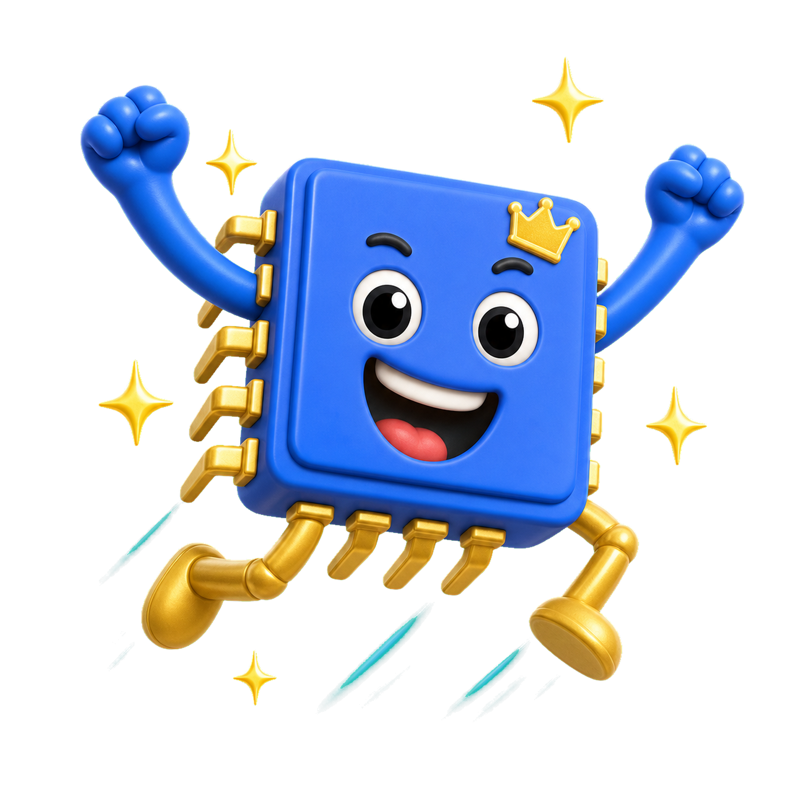

# Chipmates

<p align="center">
  
</p>

> meet the creatures inside your computer.

**By Saqlain Abbas — for everyone who thought hardware was boring.**

---

## What's This?

A playful single-page brand site for a fictional universe of **9 little creatures who live inside your computer**. Every chipmate is a real computer component — CPU, GPU, RAM, USB, modem, monitor — reimagined as a 3D claymation buddy with a name, a personality, and a job to do.

Built end-to-end as an experiment: AI-generated character design plus vanilla web craft. No framework. No build step. Just HTML, CSS, and JavaScript with GSAP doing the heavy motion.

## How It Was Made

All **44 character images, stickers, badges, and scene illustrations** were generated using **ChatGPT Image 2.0 (via Codex)** on flat chroma-key backgrounds, then processed into transparent PNGs and resized onto exact canvases.

The site itself is hand-coded vanilla — **GSAP + ScrollTrigger** for animation, **Lenis** for buttery smooth scroll, plain **Canvas 2D** for the cursor sparkle trail and confetti bursts.

## Run It

```bash
# any one of these works:
python -m http.server 8000
npx serve .
# or just double-click index.html
```

Then open **http://localhost:8000**

## Structure

```
site/
├── index.html       # 7 sections, all the markup
├── style.css        # design tokens, layout, motion
├── script.js        # GSAP, Lenis, canvas FX, Adopt-O-Matic
└── assets/          # all 44 generated images
```

No strict rules. Drop new chipmates into `assets/`, register them in the squad grid plus the `CHIPMATES` array in `script.js`, and they'll show up everywhere.

## The Squad

| # | Name | Component | Role |
|---|------|-----------|------|
| 01 | CHIP-O | CPU | the leader |
| 02 | GIGI | GPU | the show-off |
| 03 | MEMSY | RAM | the multitasker |
| 04 | DISKO | Floppy | the historian |
| 05 | CDDY | CD-ROM | the dreamer |
| 06 | PORTY | USB | the runner |
| 07 | CLICKY | Mouse | the navigator |
| 08 | PIXLE | Monitor | the watcher |
| 09 | MO | Modem | the messenger |

Plus **MOTHRA** the motherboard mama, who lives in the habitat scene.

## Deploy

It's a static site, so deploy is trivial.

- **GitHub Pages** — push and turn it on in repo settings
- **Vercel / Netlify** — drag the folder, done
- **Any static host** — upload, done

## Credits

Built by **Saqlain Abbas**
- GitHub — [@Razee4315](https://github.com/Razee4315)
- LinkedIn — [saqlainrazee](https://www.linkedin.com/in/saqlainrazee/)

**Stack:**
- Images — **ChatGPT Image 2.0** (via Codex)
- Motion — [GSAP](https://gsap.com/) + [ScrollTrigger](https://gsap.com/docs/v3/Plugins/ScrollTrigger/)
- Smooth scroll — [Lenis](https://github.com/darkroomengineering/lenis)
- Fonts — Lilita One, DM Sans, JetBrains Mono

## License

MIT — fork it, remix it, ship something cooler. Drop me a link if you do.

---

*made of bits and love.*
